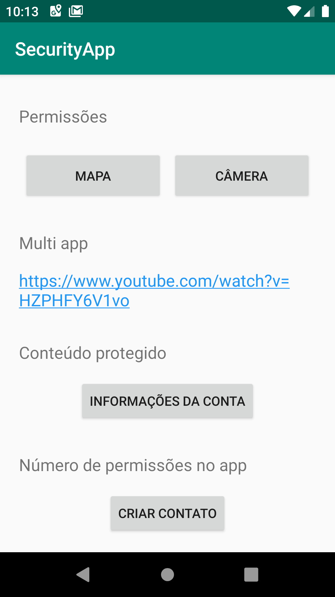
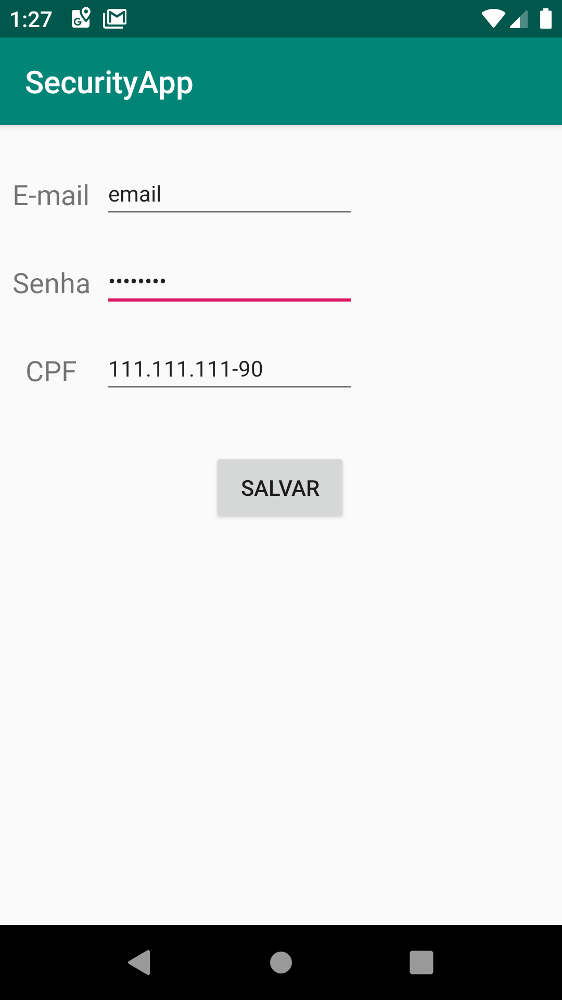

# android-security-best-practices
App simples para ilustrar as melhores práticas de segurança no android.  
Parte da disciplina IF710 - Programação com componentes (Desenvolvimento android).

## MainActivity

     

### 1. Permissões 
Nesse tópico é abordado como o app deve solicitar permissões para acessar outros apps, como a câmera, ou dados sensíveis, como localização. As permissões são solicitadas por demanda, ou seja, na medida que o usuário solicita a função.  
Ao clicar no botão da câmera o app verifica se tem acesso àquela funcionalidade e acessa a câmera caso o usuário permita.  
Ao clicar no botão do mapa o app verifica também a permissão do app para acessar a localização do dispositivo e redireciona o usuário para um app de mapas caso o usuário conceda permissão.  
### 2. Multi app
Esse exemplo ilustra a função do *appChooser* onde mais de um app instalado pode fazer detemrinada função, então pode ser escolhido com qual app o usuário deseja concluir a ação. Dessa forma, dando liberdade para o usuário escolher o app que se sente mais confortável e seguro. No exemplo, o usuário pode escolher abrir um link com youtube ou com o navegador a sua escolha.
### 3. Conteúdo protegido
Esse exemplo abre a UserInfoActivity que contém dados sensíveis do usuário, como email e senha da conta. Portanto deve ter uma etapa de autenticação antes de exibir tais dados.
### 4. Número de permissões no app
Uma boa prática é reduzir ao máximo o número de permissões solicitadas ao usuário, então deve-se sempre procurar usar apps padrões do sistema para fazer ações secundárias, uma vez que os apps padrões ja têm permissões concedidas. No exemplo, foi usado o app padrão de lista de contatos para criar um novo contato e adicionar à lista.

## UserInfoActivity

    

Nesta tela temos a exibição de dados sensíveis do usuário e uma interface que permite o usuário modificar e salvar esses dados, então esses dados estão sendo criptografados e salvos no armazenamento interno do celular numa pasta que só pode ser acessada pelo app. Uma vez que o app é desinstalado a pasta também é deletado do celular.

## Referências 
https://developer.android.com/topic/security/best-practices  
https://source.android.com/security/best-practices
